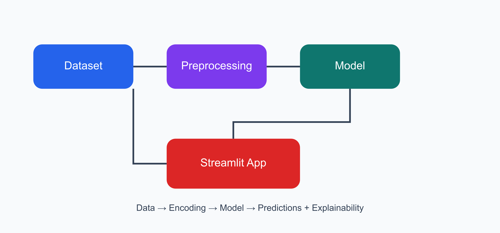

# 📊 Employee Salary Prediction

An end-to-end **Machine Learning** web application that predicts whether an individual's annual income exceeds **$50K** based on demographic, educational, and employment-related attributes. This project demonstrates the complete machine learning workflow—from data preprocessing and model training to deployment using **Streamlit**.

---

# 🚀 Live Demo

🔗 **Try the application here:**

https://employee-salary-predictor-snehagg88.streamlit.app/

> **Note:** If the application is temporarily unavailable due to deployment updates, please refer to the screenshots below or run the project locally.

---

# ✨ Features

- 🤖 Predict whether an employee earns **>50K** or **≤50K**
- 👤 Single employee salary prediction
- 📁 Batch prediction using CSV upload
- 📊 Interactive visualizations
- 📈 Model performance evaluation
- 🎯 Feature importance analysis
- 📄 Download prediction reports as PDF
- 🕘 Prediction history tracking
- 🎨 Clean and responsive Streamlit interface

---

# 🧠 Machine Learning Workflow

- Data Collection
- Data Preprocessing
- Exploratory Data Analysis (EDA)
- Feature Engineering
- Label Encoding
- Model Training
- Model Evaluation
- Best Model Selection
- Model Serialization using Joblib
- Streamlit Deployment

---

# 🛠️ Tech Stack

### Programming Language

- Python

### Libraries

- Streamlit
- Pandas
- NumPy
- Scikit-learn
- Plotly
- Matplotlib
- Joblib
- FPDF

### Tools

- VS Code
- Git
- GitHub
- Streamlit Community Cloud

---

# 📂 Project Structure

```text
Employee_Salary_Predictor/
│
├── app.py
├── adult.csv
├── best_model.pkl
├── requirements.txt
├── README.md
│
├── assets/
│   └── architecture.png
│
└── screenshots/
    ├── home.png
    ├── single_prediction.png
    ├── batch_prediction.png
    ├── history.png
    └── about.png
```

---

# 📊 Dataset

**Dataset:** UCI Adult Income Dataset

The dataset contains demographic and employment-related information, including:

- Age
- Workclass
- Education
- Marital Status
- Occupation
- Relationship
- Race
- Gender
- Capital Gain
- Capital Loss
- Hours per Week
- Native Country

### Target Variable

- Income > $50K
- Income ≤ $50K

---

# 📈 Model Performance

The application provides:

- Classification Accuracy
- Confusion Matrix
- Classification Report
- ROC Curve
- Feature Importance Analysis

---

# ▶️ Installation

### 1️⃣ Clone the repository

```bash
git clone https://github.com/Snehagg88/employee-salary-predictor.git
```

### 2️⃣ Navigate to the project folder

```bash
cd employee-salary-predictor
```

### 3️⃣ Install dependencies

```bash
pip install -r requirements.txt
```

### 4️⃣ Run the application

```bash
streamlit run app.py
```

---

# 🏗️ Application Architecture



---

# 📷 Application Screenshots

## 🏠 Home Dashboard


---

## 🔍 Single Salary Prediction


---

## 📁 Batch Prediction


---

## 📊 Prediction History


---

## ℹ️ About Page


---

# 🔮 Future Enhancements

- Hyperparameter tuning
- Cross-validation-based model selection
- Explainable AI using SHAP
- Docker containerization
- CI/CD pipeline
- Cloud database integration
- User authentication
- Model monitoring and automated retraining

---

# 🤝 Contributing

Contributions, suggestions, and feature requests are welcome.

If you'd like to improve the project, feel free to fork the repository and submit a pull request.

---

# 👩‍💻 Author

**Sneha Garg**

B.Tech (Information Technology)  
Indira Gandhi Delhi Technical University for Women (IGDTUW)

**GitHub:** https://github.com/Snehagg88

---

# ⭐ Support

If you found this project useful, please consider giving it a ⭐ on GitHub. It helps others discover the project and motivates further improvements.